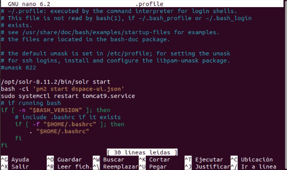
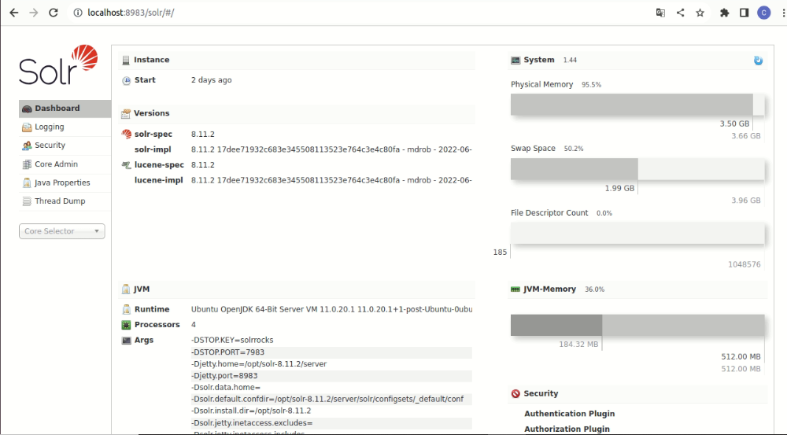

# Instalacion BACKEND en ubuntu 22.05

## Actualizar y mejorar el sistema ubuntu
```ruby
sudo apt update && sudo apt upgrade -y
```	
## Instalar git (paquete de apoyo para la instalación de DSpace)
```ruby
sudo apt install git
```
## Instalar el kit de desarrollo de Java (JDK)
```ruby
sudo apt install default-jdk
```
## Puede comprobar la versión de java con el siguiente comando las versiones JDK 11 y JDK 17 son totalmente compatibles con dsapce7
```ruby
java -version
```
## Abra el siguiente archivo para activar la variable de entorno JAVA_HOME & JAVA_OPTS
```ruby
sudo nano /etc/environment 
```

## Pegar las siguientes lineas de codigo
```ruby
JAVA_HOME="/usr/lib/jvm/java-11-openjdk-amd64"
JAVA_OPTS="-Djava.awt.headless=true -Xmx2048m -Xms1024m -XX:MaxPermSize=1024m"
```
## Guardar y Salir

## Compruebe si JAVA_HOME & JAVA_OPTS se han configurado correctamente
```ruby
source /etc/environment
echo $JAVA_HOME
echo $JAVA_OPTS
```

## Instale Apache Maven y Apache Ant en el directorio etc
```ruby
cd /etc
sudo apt install maven -y
sudo apt install ant -y
```
## Instalar la base de datos Postgresql y los paquetes relacionados
```ruby
sudo apt install postgresql postgresql-client postgresql-contrib
```
## Check the Postgres version
```ruby
psql -V psql
```

## Anote el número de versión. Los números de versión varían en Ubuntu 20.04, 22.04 y Debian-11. En mi caso, se trata de la versión 14. Sustituya el número de versión en el siguiente comando si su distribución de Linux es distinta de Ubuntu 22.04)
```ruby
sudo pg_ctlcluster 14 main start
```
## Establecer la contraseña para Postgres
```ruby
sudo passwd postgres
admin2023
```
##  Ingrese al usuario postgres
```ruby
su postgres
```
## Ejecute los siguientes comandos para comprobar si UTF8 está activado
```ruby
cd /etc/postgresql/14/main
psql -c "SHOW SERVER_encoding"
```
## Si todo esta bien debe aparecer esto
```ruby
postgres@tics:/etc$ cd /etc/postgresql/14/main
postgres@tics:/etc/postgresql/14/main$ psql -c "SHOW SERVER_encoding"
 server_encoding 
-----------------
 UTF8
(1 row)
```
## Salir del usuario postgres 
```ruby
exit
```

## Descomenta la siguiente línea eliminando '#' en la opción de configuración de la conexión
```ruby
sudo nano  /etc/postgresql/14/main/postgresql.conf
Descomente : listen_addresses = 'localhost'
```
## Encuentre la línea "# Database administrative login by Unix domain socket" y añada la siguiente línea encima de esta línea
```ruby
sudo nano /etc/postgresql/14/main/pg_hba.conf
host dspace dspace 127.0.0.1 255.255.255.255 md5
```
## Reinicie PostgreSQL
```ruby
sudo systemctl restart postgresql
sudo systemctl enable postgresql
sudo systemctl start postgresql
```
## Instale Solr en el directorio opt (Aplique los siguientes comandos)
```ruby
cd /opt
sudo wget  https://downloads.apache.org/lucene/solr/8.11.2/solr-8.11.2.zip
```
## Instalación de unzip 
```ruby
sudo apt install unzip
sudo unzip solr-8.11.2.zip
sudo rm solr-8.11.2.zip
```
## Cambiar los permisos del directorio solr (tics:tics se reemplaza por el usuario del pc)
```ruby
sudo chown -R tics:tics solr-8.11.2
```
## Creer el directorio dspace en el directorio raíz (/)
```ruby
cd /
sudo mkdir /dspace
```
## Cambiale los permisos al directorio /dspace
```ruby
sudo chown -R tics:tics /dspace
```
## Ingrese a .profile y (pegue la siguiente línea en el archivo para iniciar automáticamente Solr y guarde el archivo)
```ruby
cd
nano .profile
/opt/solr-8.11.2/bin/solr start
 ```

## Ahora aplica los siguientes comandos desde la terminal para iniciar el solr
```ruby
/opt/solr-8.11.2/bin/solr start
```

## Abra la siguiente URL en el navegador y verifique si el panel de administración de Solr está cargado
```ruby
http://localhost:8983/solr
```

## Instalar TOMCAT9
```ruby
cd
sudo apt install tomcat9
```
## Abre el siguiente archivo, agregue la siguiente línea en la parte inferior debajo de la seguridad (Anexo 4)
```ruby
sudo nano /lib/systemd/system/tomcat9.service
ReadWritePaths=/dspace
```
## Abra el siguiente archivo en la carpeta tomcat
```ruby
sudo nano /etc/tomcat9/server.xml
```
#(Encuentre las siguientes líneas en el archivo)
```
<Connector port="8080" protocol="HTTP/1.1"
                   connectionTimeout="20000"
                   redirectPort="8443" />
(Reemplace las líneas anteriores con las siguientes líneas) Anexo 5
  <Connector port="8080" protocol="HTTP/1.1"
            minSpareThreads="25"
            enableLookups="false"
            redirectPort="8443"
            connectionTimeout="20000"
            disableUploadTimeout="true"
            URIEncoding="UTF-8"/>
```
## Ejecute el siguiente comando
```ruby
sudo systemctl daemon-reload
```
## Inicia el servicio de Tomcat y reinicie el Tomcat
```ruby
sudo systemctl restart tomcat9.service
sudo systemctl enable tomcat9.service
sudo systemctl start tomcat9.service
```
## Instalacion  back-end de Dspace
```ruby
wget https://github.com/DSpace/DSpace/archive/refs/tags/dspace-7.5.zip
unzip dspace-7.5.zip
sudo rm dspace-7.5.zip
```
## Cambiar el permiso al directorio dspace
```ruby
sudo chown -R tics:tics DSpace-dspace-7.5
```
## Acceso a PostgreSQL
```ruby
echo "host dspace dspace 127.0.0.1/32 md5" | sudo tee -a /etc/postgresql/14/main/pg_hba.conf

sudo sed -i 's/ident/trust/' /etc/postgresql/14/main/pg_hba.conf
sudo sed -i 's/md5/trust/' /etc/postgresql/14/main/pg_hba.conf
sudo sed -i 's/peer/trust/' /etc/postgresql/14/main/pg_hba.conf

sudo systemctl restart postgresql
```
## Configuración de base de datos 
```ruby
su postgres
```
## Ingrese al siguiente directorio (cambie el número de versión de Postgres según corresponda)
```ruby
cd /etc/postgresql/14/main
createuser dspace
createdb dspace -E UNICODE
psql -d dspace
CREATE EXTENSION pgcrypto;
```
## Crear una contraseña
```ruby
ALTER ROLE dspace WITH PASSWORD 'dspace';
ALTER DATABASE dspace OWNER TO dspace;
GRANT ALL PRIVILEGES ON DATABASE dspace TO dspace;
\q
exit
sudo systemctl restart postgresql
```
## Configuración de DSpace (Ingrese al directorio de configuración de dspace)
```ruby
cd
cd DSpace-dspace-7.5/dspace/config
```
## Haga una copia del archivo 'local.cfg.EXAMPLE' llamado 'local.cfg'
```ruby
cp local.cfg.EXAMPLE local.cfg
nano local.cfg
```
## (Cambia el nombre de tu repositorio)
```ruby
dspace.name = DSpace at CRUZ ROJA JPI 
dspace.server.url = http://192.168.3.105:8080/server
dspace.ui.url = http://192.168.3.105:4000
```
## Descomentar : 
```ruby
solr.server = http://192.168.3.105:8983/solr
```
## Este lo dejamos con localhost
```ruby
db.url = jdbc:postgresql://localhost:5432/dspace
```
## Cambie el nombre de usuario y la contraseña de la base de datos si hay algún cambio
```ruby
db.username = dspace
db.password = dspace
``` 
### Guardar y salir

## Guarda la anterior configuración y dirige al directorio DSpace-dspace-7.5, luego cree el paquete de instalación (Anexo 6)
```ruby
cd /home/tics/DSpace-dspace-7.5
mvn package
```
## Instale DSpace Backend (Ingrese al directorio de instalación de dspace Anexo 7)
```ruby
cd /home/tics/DSpace-dspace-7.5/dspace/target/dspace-installer/
ant fresh_install
```
## Inicializar la Base de Datos (Aplicar los siguientes comandos)
```ruby
cd /dspace/bin
./dspace database migrate
```
## Si todo esta bien debe mostrarse como la figura del ANEXO 8

## Copie el directorio de aplicaciones web de dspace en el servidor Tomcat
```ruby
sudo cp -R /dspace/webapps/* /var/lib/tomcat9/webapps*
```
## Ahora copie el directorio Solr
```ruby
cd /dspace/solr
cp -R /dspace/solr/* /opt/solr-8.11.2/server/solr/configsets
```
## Ahora reinicie el Solr
```ruby
cd /opt/solr-8.11.2/bin
./solr restart
```
## Crear administrador
```ruby
cd
sudo /dspace/bin/dspace create-administrator
email: ticsimbabura@cruzroja.org.ec
First name: Tics
Last name: Imbabura
password: admin2023
```
## Cambie los permisos de dspace a Tomcat User
```ruby
sudo chown -R tomcat:tomcat /dspace
```
## Reinicie el Tomcat
```ruby
sudo systemctl restart tomcat9.service
```
## Verificar si el backend esta bien realizado (Anexo 9)
```ruby
http://192.168.3.105:8080/server/#/server/api
```
#ANEXOS
###https://docs.google.com/document/d/1Lk9rCsM1B2eGWieCiP7c8on3vC41-dCC/edit


