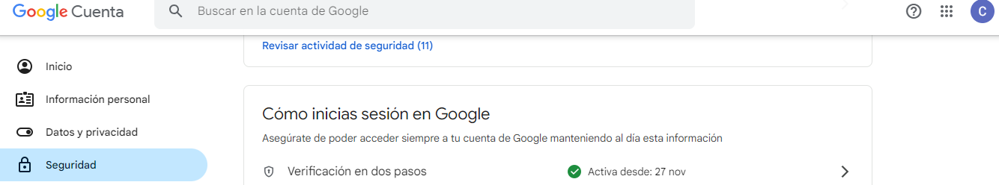
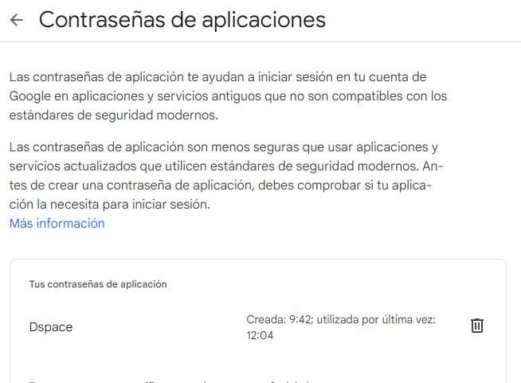

# Crear una cuenta en gmail
A la actualidad en 2023 la opción de *Menos seguridad a la cuenta* en gmail ya no esta disponible por lo tanto, es necesario crear una contraseña para aplicaciones mediante la verificacion de dos pasos. \
Para este caso en específico la cuenta creada es: dspacejpi@gmail.com \
Luego se realiza la verificación de 2 pasos hasta tener activa esta opción como se muestra a continuación:

# Generar contraseña de aplicación
Opción Verificación de 2 pasos \
Contraseña de aplicaciones\
Crear una contraseña de aplicación \
 \
*La contraseña de 16 digitos generada se debe copiar para montar en el mail server dspace*
# Configuración archivo DSPACE
Colocar los siguientes comandos en el terminal de ubuntu
cd /dspace/config/  \
sudo nano local.cfg
