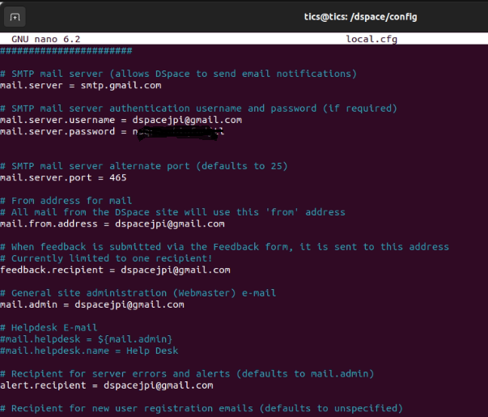
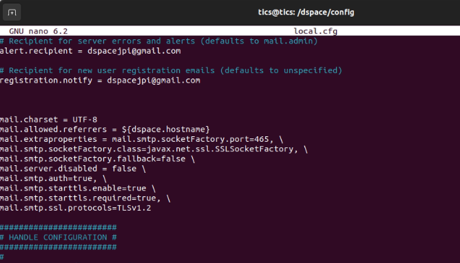

# Crear una cuenta en gmail
A la actualidad en 2023 la opción de *Menos seguridad a la cuenta* en gmail ya no esta disponible por lo tanto, es necesario crear una contraseña para aplicaciones mediante la verificacion de dos pasos. \
Para este caso en específico la cuenta creada es: dspacejpi@gmail.com \
Luego se realiza la verificación de 2 pasos hasta tener activa esta opción como se muestra a continuación:

# Generar contraseña de aplicación
--> Opción Verificación de 2 pasos \
--> Contraseña de aplicaciones\
--> Crear una contraseña de aplicación \
 \
*La contraseña de 16 digitos generada se debe copiar para montar en el mail.server.password de dspace*
# Configuración archivo DSPACE
Colocar los siguientes comandos en el terminal de ubuntu 
```ruby
cd
cd /dspace/config/
sudo nano local.cfg
```
Modificar el correo electrónico y añadir la contraseña de aplicación como se muestra en la imagen  \
 \
Copiar las siguientes lineas de código como se muestra en la imagen

```ruby
mail.charset = UTF-8
mail.allowed.referrers = ${dspace.hostname}  
mail.extraproperties = mail.smtp.socketFactory.port=465, \
mail.smtp.socketFactory.class=javax.net.ssl.SSLSocketFactory, \
mail.smtp.socketFactory.fallback=false \
mail.server.disabled = false \
mail.smtp.auth=true, \
mail.smtp.starttls.enable=true \
mail.smtp.starttls.required=true, \
mail.smtp.ssl.protocols=TLSv1.2
```
 

### Una vez copiadas las líneas de código se guarda y se cierra el archivo,. A continuación, se realiza el test-email ejecutando lo siguiente:
```ruby
cd
cd /dspace
sudo ./bin/dspace test-email
```
Si el proceso fue realizado con éxito aparecerá lo siguiente en la consola:
 
